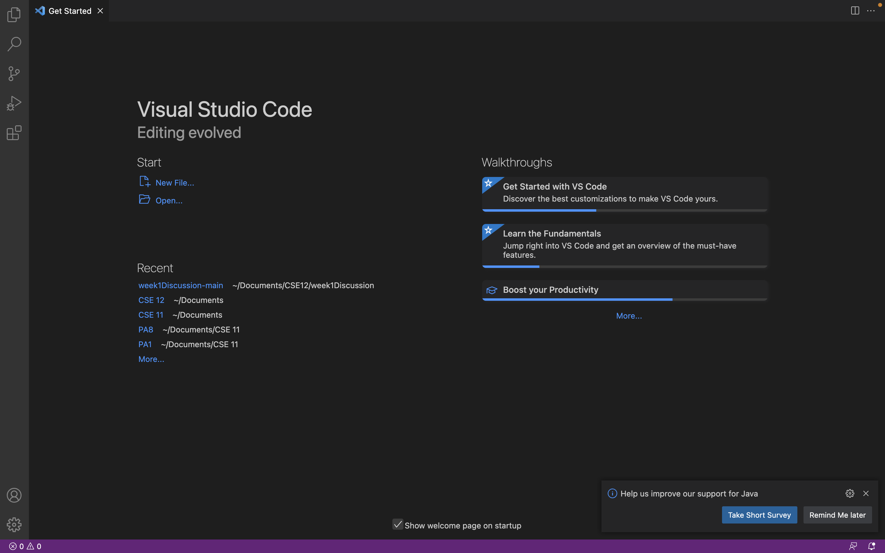
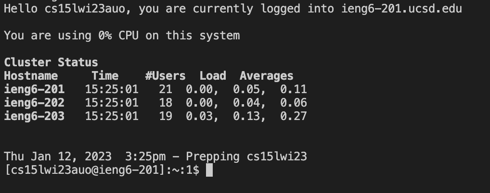
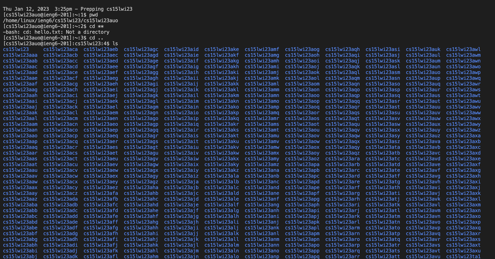

# Logging into a course-specific account on `ieng6`
This page is a written tutorial for incoming 15L students on how to log into their 15L account on `ieng6`.

## Part 1: Installing VSCode
Follow the instructions on the [Visual Studio Code website](https://code.visualstudio.com/) to download VSCode. 
Once you're finished installing VSCode, you should be able to open up a window that looks like this: 

* Your screenshot may have a different color scheme or a different set of options, but the overall layout should still be the same. 

## Part 2: Remotely Connecting
**Important:** Instructions are for students on a Mac.

First, open a terminal on VSCode. Go the menu bar and click Terminal, then click "New Terminal". A terminal should open. 
Type the command into the terminal, making sure to replace `zzz` with the letters in your specific username. Do not include the `$`. 
```
$ ssh cs15lwi23zzz@ieng6.ucsd.edu
```
Since this is the first time you are logging to this server, you will get a message like this:
```
The authenticity of host 'ieng6.ucsd.edu (128.54.70.227)' can't be established.
RSA key fingerprint is SHA256:ksruYwhnYH+sySHnHAtLUHngrPEyZTDl/1x99wUQcec.
Are you sure you want to continue connecting (yes/no/[fingerprint])? 
```
Type `yes` in the terminal and press enter. It should prompt you for your password. 
**Important**: When you type your password, anything you type will not be visible for privacy reasons, although it is being recorded.
Once you have entered your password, your window should look like this:

Congrats! You have successfully connected to a computer in the CSE basement! 

## Part 3: Run Some Commands
Now let's try running some different commands. Try some basics like `pwd`, `ls`, `cd`, `mkdir`, and `cp`. 
Here is the screen after trying the commands `pwd`, `cd ..`, and `ls`. 


Some other commands you can try:
* Trying to access someone else's directory:
```
ls /home/linux/ieng6/cs15lwi23/cs15lwi23aaa
```
where `aaa` is the username of another group member.

* Returning to the home directory: `cd ~`
* Copying the file `hello.txt`: `cp /home/linux/ieng6/cs15lwi23/public/hello.txt ~/`
* Running the file `hello.txt`: `cat /home/linux/ieng6/cs15lwi23/public/hello.txt`
* Making a new directory called `new directory`: `mkdir new directory`
