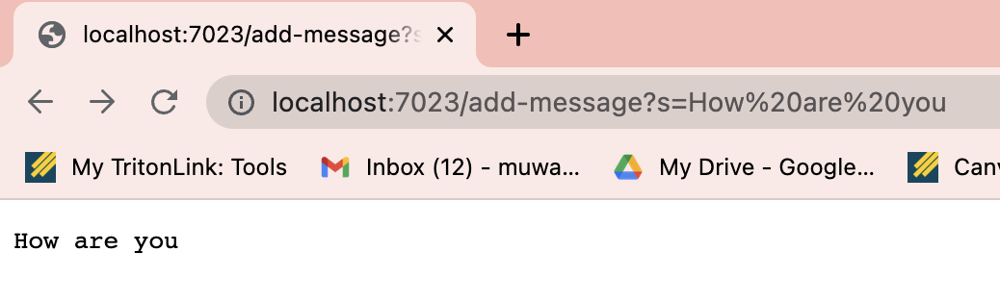
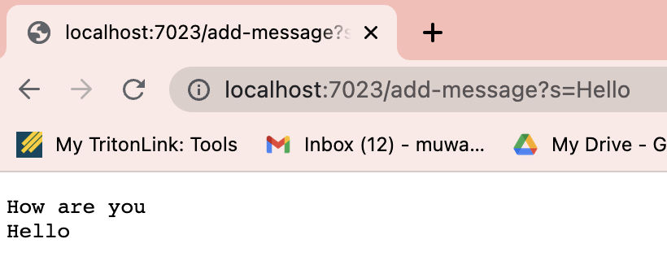
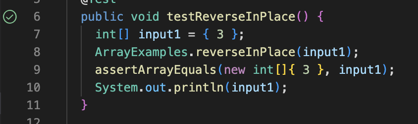
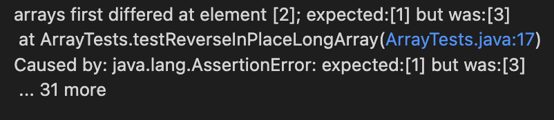

# Lab Report 2


## Part 1: StringServer web server

```
// StringServer's code
import java.io.IOException;
import java.net.URI;
import java.util.*;

class Handler implements URLHandler {
    ArrayList<String> queries = new ArrayList<String>();

    public String handleRequest(URI url) {

        if (url.getPath().equals("/")) {
            return queries.toString();
        }
        else if (url.getPath().contains("add-message")) {
            String[] parameters = url.getQuery().split("=");
            if (parameters[0].equals("s")) {
                queries.add(parameters[1]);
            }
        }  
        else {
            return "404 Not Found!";
        }

        String messages = "";
        for(String s: queries) {
            messages += s + "\n";
        }

        return messages;
    }
}

class StringServer {
    public static void main(String[] args) throws IOException {
        if(args.length == 0){
            System.out.println("Missing port number! Try any number between 1024 to 49151");
            return;
        }
        int port = Integer.parseInt(args[0]);

        Server.start(port, new Handler());
    }
}
```

Here is one example of using `add-message`.



Because this is the first URL on this server, an `ArrayList` named `queries` is created in order to store all of the messages as a new `Handler` was created. Then we go to `handleRequest`. The argument `URI url`, or `http://localhost:7023/add-message?s=How are you`. In there, the `else if` statement is activated, as the URL path (`/add-message`), the argument in this case, contains the phrase `add-message`. From there, the query,`s=How are you`, is processed by being split into `String`s based on the separator of `=`. Because the first part of the array is `s`, the second part of the query, `How are you`, is added into the list `queries`. A new `String` is created and each element from `queries`, really only `How are you` for this URL, is printed. 


Here is another example of using `add-message`, this time right after the first example.

This time, a new `ArrayList` does not need to be created; `queries` remains the same and only the method is called. This URL, `http://localhost:7023/add-message?s=Hello`is taken in as the parameter for `handleRequest`. Like the previous example, the `else if` statement is activated, as the URL path contains the phrase `add-message`. Additionally, the query is split based on `=`, the first part of the array is `s`, the second part of the query, `Hello`, is added into the list `queries`. The list `queries` is altered to add in this new element. To return a `String`, a new `String` is created and both elements are added to it. 

---

## Part 2: Debugging
From the class `ArrayExamples.java`, there was an error in the `reverseInPlace` method. 

The original code was:
```
static void reverseInPlace(int[] arr) {
    for(int i = 0; i < arr.length; i += 1) {
      arr[i] = arr[arr.length - i - 1];
    }
  }
```

While this test:
```
@Test 
	public void testReverseInPlace() {
    int[] input1 = { 3 };
    ArrayExamples.reverseInPlace(input1);
    assertArrayEquals(new int[]{ 3 }, input1);
    System.out.println(input1);
	}
```
Succeeded, as evidenced by the green check mark:


This test,
```
@Test
  public void testReverseInPlaceLongArray() {
    int[] input1 = {1, 2, 3};
    ArrayExamples.reverseInPlace(input1);
    assertArrayEquals(new int[]{3, 2, 1}, input1);
  }
```
fails, as the expected last element of `1` is instead `3`.


So what's going on here? Because the method overwrites `arr[i]` with `arr[arr.length - i - 1]`, we don't actually get to switch the first element with the last element, as they'll actually be the same. For the example `[1, 2, 3]`, `1` is changed to `3`, `2`'s value is assigned to itself, and the last element `3` is assigned to the value of the first element... which is also `3`. 


To fix both the actual bug and make the program the tiniest bit more efficient, we can do this instead. 
```
static void reverseInPlace(int[] arr) {
    for(int i = 0; i < arr.length/2; i += 1) {
      int temp = arr[i];
      arr[i] = arr[arr.length - i - 1];
      arr[arr.length - i - 1] = temp;
    }
  }
```
We have cut the amount of times we loop into half, which is possible because the code inside effectively switches the values across from each other. There is no need to account for even vs. odd array lengths because in an odd length array, the middle element does not change. 

---

## Part 3: Learning something new!
I learned first what the different parts of an URL were, then about how to parse through a URL and take in parts of it as an argument to display certain results. Even though I wasn't able to see how or why the Server.java worked, I was still able to work through and use the debugging we learned in Lab 3 to make sure all parts of my web server worked as I wanted them to. 
