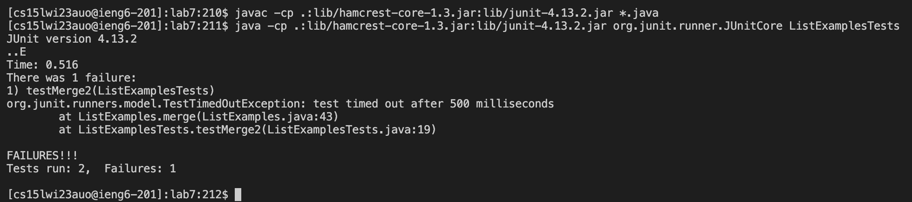

# Lab Report 4

## Step 1: Logging into `ieng6`

**Keys:** `<Ctrl-R>, s, s, <enter>`

For this step, I knew that I had previously logged into `ieng6` but it wouldn't have been my most recent command so I searched for it in my history using `<Ctrl-R>`. I then searched with the `ss` part of the full command and pressed `<enter>`. This logged me into my `ieng6` remote account.

## Step 2: Cloning the fork

**Keys:** `git clone, <Ctrl-C>`

I just typed the full thing out because for some reason, I don't think I had typed it before in the history of using my `ieng6` account. If I were trying to speed this process up, I would have previously typed it out then pressed `<up>` to get to it. This command cloned the forked repository to my `ieng6` account using the `ssh` key so I could push without having to confirm passwords. 

## Step 3: Running tests

**Keys:** `<Ctrl-R>, javac, <enter>` then `<Ctrl-R>, java_ , <right>, <Ctrl-E>, <Ctrl-W>, ListExamplesTests` where `_` is a space.

I knew I had compiled all the java files at somepoint, so I searched in my history for `javac` to do that. Next, I searched for a command that ran the tests, but it was the wrong file. I went to the end of the line using `<Ctrl-E>`, deleted the last word (AKA the wrong file name) using `<Ctrl-W>` and replaced it with `ListExamplesTests`. These commands ran and compiled the java tests, showing that there was one error. 

## Step 4: Editing code

**Keys:** `nano L, <tab>, .java, <enter>, <Ctrl-W>, return, <enter>, <up>, <up>, <right>, <right>, <right>, <right>, <right>, <right>, <backspace>, 2, <Ctrl-O>, <Ctrl-X>`

First, I had to edit the file, which I did using `<nano>` as well as autocomplete to avoid writing the whole file name, although I was forced to type `.java` because both the class and java file were named `ListExamples`. Next, I searched for `return`, where I knew the error was from the previous lab. I tried searching for `index1` but because there were so many instances of it, it was just faster to go to something near the error. All those arrow keys were me naviagting to the error from my search. Using the `<right>` arrow, I then replaced the erroneous `index1` with `index1`. Then I saved the file and closed `nano` by using `<Ctrl-O>, <Ctrl-X>`

## Step 5: Running Tests (Part 2)

**Keys:** `<up>, <up>, <up>, <enter>, <up>, <up>, <up>, <enter>`

I had literally just run the tests (See Step 3), so I just used the up arrow to access the commandds that compilin the edited files and run the test file from my history, then pressed enter. 

## Step 6: Committing and Pushing

**Keys:** `git add L, <tab>, <enter>, git commit -m "Debugged", git push`

I just typed everything out here, with the exception of using `<tab>` to autocomplete the name of the updated file. These commands made it so that the remote repository was also updated with the changes. 

